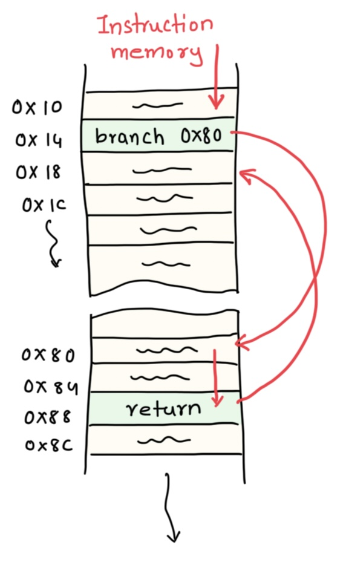
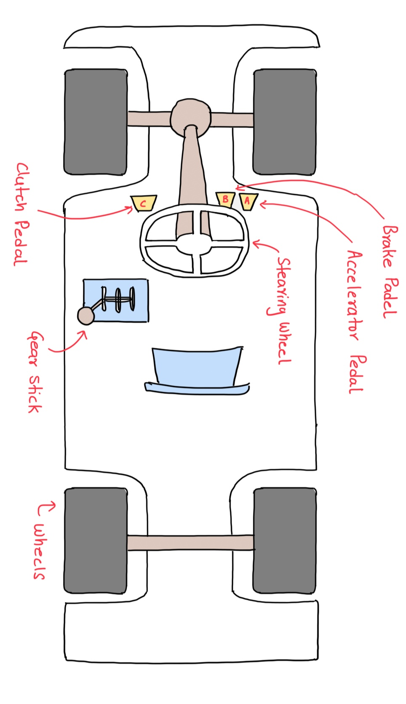
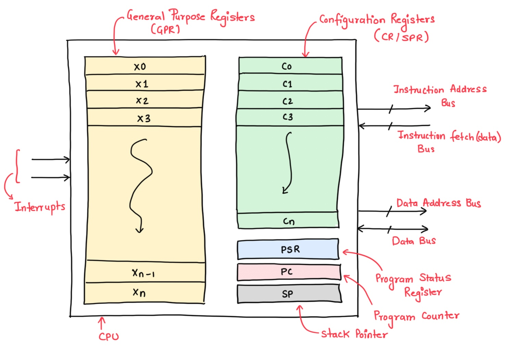
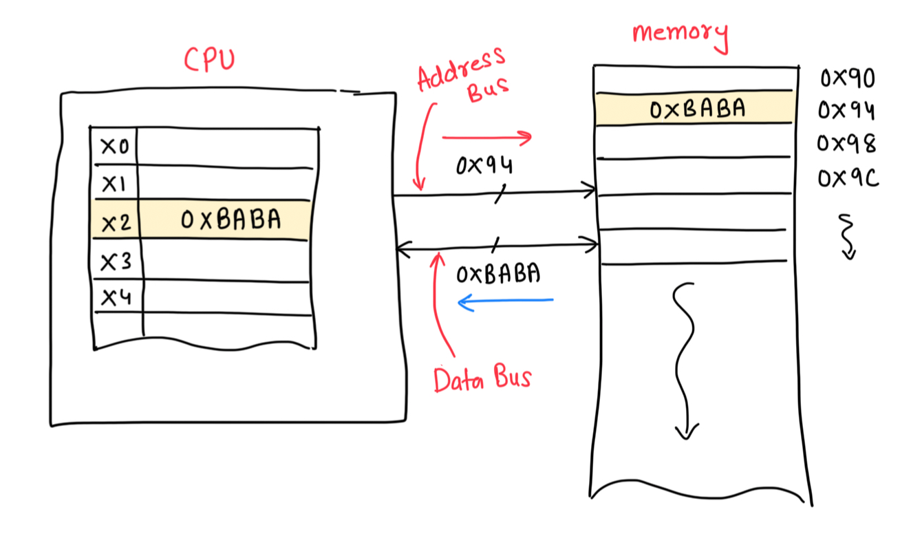
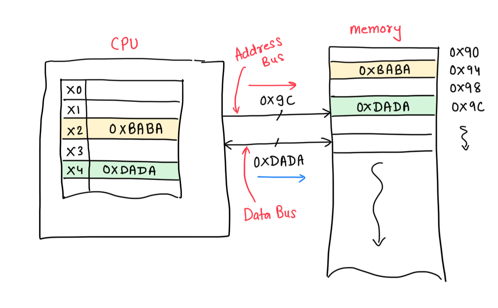
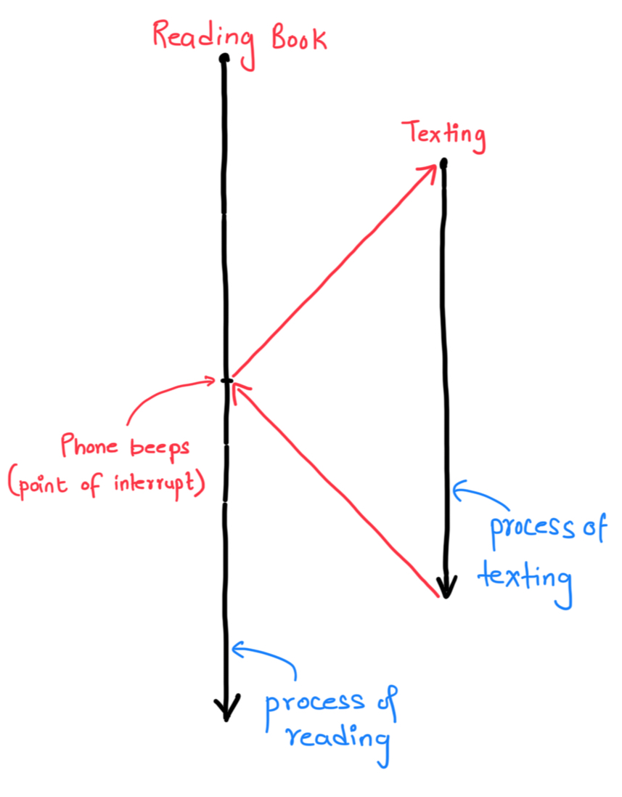

+++
date = '2026-07-10T10:00:00+05:30'
draft = false
title = 'Model of the CPU'
description = 'As a programmer this is what you need to know about the CPU.'
og_image = 'cpu-programmers-model.jpeg'
difficulty = 'easy'
language = 'c'
topic_weight = -20
subtopic_weight = 1
weight = 3
initial_code = '''/*
 * Copyright © 2026 Typobrahe Education LLP (pyjamacafe.com)
 * All Rights Reserved.
 *
 * Description: Demonstrates function call and return — a simple add procedure.
 */
int add(int a, int b) {
    return a + b;
}

int main(void) {
    int x = 5;
    int y = 10;
    int z = add(x, y);
    return z;
}
'''
+++

## Think, Try, Reason...

Describe the fetch-decode-execute cycle in detail. What happens in each step at the hardware level? Trace how the simple C function `int add(int a, int b) { return a + b; }` is executed step by step inside the CPU. The code in the pane is correct but will fail. You need to fix it!

## main()

Functions as we discussed in the previous chapters is a way to group instructions together.

To add to the details, we call line `14` a call to the `add()` function.

Most programs in C start the execution from the `main()` function. We call `main()` the entry point and you can assume, give a C source code, the fist function to be executed will be `main()`.

That said, the in certain very specific/engineered cases we can make some other function the entry point! More on this when we program a CPU from scratch. For now, assume `main()` is the first function to execute.

## int

From the code, we have `x`, `y` and `z` which we call variables. While we will discuss more about these later, the syntax in the current scenario suggests that all three of them are of the type `int` (read `integer`).

C has something called primitive data-types and this is one of those. Depending on the machine an `int` would mean that the variable (`x`, `y` and `z`) span wither `2` or `4` Bytes!

For the machine which will execute this code, the `int` width is `4` Bytes.

## function call

Line `14` from the snippet is called a **Function Call**. A call to `add()` function. Imagine the CPU executes the instructions starting from line `12`, as it comes to line `14`, it must jump to line `8`, compute the answer and return to line `14`.

The value of `z` will be whatever the evaluation of line `8` was.

## Return type and the `return` Keyword

The `int` on the left of `main()` and `add()` are deliberate. In case of `add()` this conveys what type of value will the function generate. On line `14`, this generated value is assigned to `z`. We say - **The function returns value of type int**. The value is returned to the caller.

`main()` also returns a value. But to whom?

The Answer is the caller. In this case the OS!

# Fix the code

Run the code by hitting the `Check` button and you should see it fails.
```shell
Runtime Error
No output
```

The program is correct, but see the value being returned. It has to be `0`. Setting line `15` to

```c
return 0;
```

Will solve the problem

```shell
All test cases passed.

Exit code: 0
```

You can run more experiments by changing the values of `x` and `y` and then print the value of `z`, by adding this line between line `14`-`15`, like so:
```c
    int z = add(x, y);
    printf("z = %d\n", z);
    return 0;
```

Here the `%d` is a placeholder for the value of `z`. The `\n` tells printf to print a new line on the terminal.

The output should be like -
```shell
All test cases passed.
z = 15

Exit code: 0
```

===EXPLANATION===

# The Rhythm

<figure id="fig-1" class="fig-right">
  
  <figcaption><a href="#fig-1" class="fig-link">Figure 1:</a> Instructions</figcaption>
</figure>

The fetch-decode-execute cycle is the heartbeat of every computer. Every program, from a bootloader to a web browser, is ultimately a sequence of machine words stored in memory, and the CPU's job is to march through this sequence one instruction at a time.

The elegance of the stored-program concept is that the CPU is a simple automaton: read a word from memory at the address in the PC (program counter), figure out what it means, do it, repeat. The complexity of a modern OS (scheduling, virtual memory, interrupts, multi-core synchronization) is all built on top of this primitive foundation. When you understand the cycle, you understand why certain C constructs are expensive (function calls involve saving/restoring registers and jumping the PC) and others are cheap (arithmetic on register variables).

The intuition is that the CPU is a factory assembly line. The PC is the blueprints showing which page to work from next. The Fetch step is the warehouse worker pulling the blueprint page (the instruction word) and handing it to the foreman. The Decode step is the foreman reading the blueprints and deciding which machines and workers to activate: "Smith, you operate the welding machine on part A and part B. Jones, get the riveter ready." The Execute step is actual production: the machines run, parts are assembled, and the result comes out.

The Write-back step is storing the finished part in the finished-goods bin (a register). The clock is the production line speed - every tick, one step of the process advances. A pipeline is multiple assembly lines running in parallel: while station 1 is welding, station 2 is riveting the previous part, and station 3 is painting the one before that.

The RISC philosophy (exemplified by RISC-V and ARM) is to make each station in the assembly line do exactly one simple job per cycle. A RISC instruction always fits in one 32-bit word, always has three operands (two source registers, one destination), and always does one thing (add, load, branch). This simplicity means the pipeline never stalls because an instruction needs multiple cycles to finish. In contrast, CISC ISAs like x86 have variable-length instructions (1–15 bytes) and instructions that do complex things (e.g., `REP MOVSB` copies a string — microcoded as dozens of micro-ops). The RISC trade-off is code size (more instructions per program) for predictable performance (almost everything executes in one cycle).

# Abstraction: Ignoring the Details

<figure id="fig-2" class="fig-left">
  
  <figcaption><a href="#fig-2" class="fig-link">Figure 2:</a> Top view of a car — an analogy for abstraction and mental models</figcaption>
</figure>

To understand why abstraction is so powerful, consider the analogy of driving a car (Figure 2). A car has millions of moving parts — engine pistons, fuel injectors, transmission gears, differentials, braking hydraulics — but we manage to drive it by knowing very little about its internal mechanics.

The abstraction of a car that we use is a mental model: a simplified representation that allows us to interact with the car without understanding every intricate detail. We perceive the car as a single entity with input mechanisms (steering wheel, pedals, gear lever) and output behaviors (direction change, speed). The steering wheel changes direction, the accelerator increases speed, the brake decreases speed, and the gear lever controls power-torque combination.

As long as these few abstractions work reliably, no one cares about the internals. This is exactly the relationship a C programmer has with the CPU — the **Programmer's Model** is the abstraction that hides the complex hardware implementation.

## The Programmer's Model

The programmer's model of the CPU can be summarized as: **the CPU is a state machine. The state is maintained within a set of registers internal to the CPU. The programmer manipulates this state via a sequence of instructions. The CPU can also modify its state as a side effect of computation or an external event (interrupt).** The key components of this model are:

<figure id="fig-3" class="fig-center">
  
  <figcaption><a href="#fig-3" class="fig-link">Figure 3:</a> CPU programmer's model showing registers and execution units</figcaption>
</figure>

1. **General Purpose Register File** — a set of registers for temporary storage, intermediate calculations, and data manipulation. These are accessible directly by the programmer and provide the fastest storage in the system. Both ARM and RISC-V are RISC architectures, meaning data must be brought into registers from memory, operated upon, and saved back — you cannot manipulate memory in place.
2. **Program Counter (PC)** — keeps track of the memory address of the next instruction to be fetched and executed. It auto-increments after each instruction fetch (usually, by 4 for 32-bit instructions).
3. **Stack Pointer (SP)** — holds the memory address of the top of the stack, used for temporary data, local variables, and return addresses during function calls.
4. **Link Register (LR)** — holds the return address during a function call, allowing the CPU to return to the calling code after a procedure completes.
5. **Program Status Register (PSR)** — stores the current status of the CPU and execution context: operating mode (user vs privileged), arithmetic overflow flags, interrupt status, and other relevant information.
6. **Configuration Registers** — control CPU behavior including clock frequency, cache configuration, and power management.

## Registers and Buses
<!--auth-->

The CPU interfaces with the outside world via **Buses** and **Interrupts**. There are four buses connecting the CPU to memory and peripherals:

- **Instruction Address Bus** — carries the memory address from which the next instruction will be fetched (driven by the PC register).
- **Instruction Fetch (Data) Bus** — carries the actual instruction word returned from memory at the address provided by the Instruction Address Bus.

<figure id="fig-4" class="fig-center">
  
  <figcaption><a href="#fig-4" class="fig-link">Figure 4:</a> LDR instruction execution in the CPU</figcaption>
</figure>

- **Data Address Bus** — activated during load/store instructions, pointing to the address in memory where data is to be read or written.
- **Data Bus** — carries the actual data value being loaded into a CPU register (load) or written from a CPU register to memory (store).

<figure id="fig-5" class="fig-center">
  
  <figcaption><a href="#fig-5" class="fig-link">Figure 5:</a> STR instruction execution in the CPU</figcaption>
</figure>

### Interrupts and Buses

<figure id="fig-6" class="fig-right">
  
  <figcaption><a href="#fig-6" class="fig-link">Figure 6:</a> Example of an interrupt and the Interrupt Service Routine (ISR) flow</figcaption>
</figure>

**Interrupts** are signals from external devices or internal events that cause the CPU to suspend its current execution and switch to a different code path (the Interrupt Service Routine, or ISR).

Think of it like reading a book when your phone beeps: you pause reading, save your place, check the message, and then return to exactly where you left off. The CPU does the same: it saves its state (PC, registers, PSR), jumps to the ISR, executes the interrupt handler, and then restores the saved state to resume the original program.

Figure 6 illustrates this flow. Interrupts are essential for real-time embedded systems — they allow the CPU to respond immediately to external events (a button press, a timer expiry, a data byte arriving on UART) without wasting CPU cycles polling for these events.

---

# Key take away

- **CPU core components**:
  - **Program Counter (PC)**: Contains the address of the next instruction to fetch. Auto-increments after each fetch (by 4 bytes for 32-bit instructions).
  - **Instruction Register (IR)**: Holds the currently fetched instruction during decode and execution.
  - **Register File**: A small, fast array of storage locations (e.g., 16 or 32 general-purpose registers in RISC-V). Registers (More about these in later chapters) are the fastest storage in the memory hierarchy.
  - **Arithmetic Logic Unit (ALU)**: Combinational circuit that performs arithmetic (add, sub, mul) and logic (and, or, xor, shift) operations on register values.
  - **Control Unit**: Finite state machine that decodes the instruction in the IR and generates control signals (reg_file_write_enable, alu_op_select, memory_read, memory_write, pc_source_select, etc.).
  - **Clock**: Square wave signal that drives the state machine. Each clock cycle advances the CPU through its micro-operations.

- **The Fetch-Decode-Execute cycle**:
  1. **Fetch**: The address in the PC is placed on the address bus. Memory returns the instruction word, which is loaded into the IR. The PC is incremented (PC ← PC + 4 for a 32-bit ISA).
  2. **Decode**: The Control Unit examines the opcode and `funct` fields of the instruction in the IR. It asserts the appropriate control signals: register read addresses are sent to the register file, ALU operation is selected, and data paths are configured.
  3. **Execute**: The ALU performs the requested operation (e.g., ADD reads two registers, computes the sum, and writes the result back to the destination register). For memory instructions (load/store), the address is computed and sent to the memory system.
  4. **Write-back** (sometimes a separate stage): The result from the ALU or memory is written into the destination register.

- **Pipelining**: Modern CPUs overlap the stages — while instruction N is executing, instruction N+1 is being decoded, and instruction N+2 is being fetched. A 5-stage pipeline (Fetch, Decode, Execute, Memory, Writeback) is the classic RISC design. Hazards (data dependencies, branches) stall or flush the pipeline.

## Real World Application

The fetch-decode-execute cycle is not just theory — it directly determines software performance.

A tight loop running entirely from registers (no memory access) can execute one iteration per clock cycle in a pipelined CPU. A loop that accesses memory may stall for 10–100 cycles per cache miss. This is why optimizing compilers spend enormous effort on register allocation (keeping frequently-used values in registers rather than memory).

On the ARM Cortex-M4, the three-stage pipeline (Fetch, Decode, Execute) relies on a static 'assume not-taken' design. This means an untaken conditional branch costs zero extra cycles—but a taken branch flushes the pipeline, costing a 2 to 3 cycle penalty to reload from the target address.

---

# References:
1. ARM Cortex-M4 Technical Reference Manual
1. Programmer's model for the Cortex-M4 CPU
<!--/auth-->

===QUIZ===

## During the fetch stage of the fetch-decode-execute cycle, what two things happen to the Program Counter (PC)?
- [ ] It is reset to zero
- [x] It is used to address memory for the instruction, then incremented by the instruction size
- [ ] It is copied to the Instruction Register
- [ ] It is decremented to point to the previous instruction
Correct: B
Explanation: During the fetch stage, the CPU places the current PC value on the address bus to read the instruction word from memory (which is loaded into the Instruction Register). Simultaneously, the PC is incremented (typically by 4 for 32-bit instructions) to point to the next instruction in sequence, preparing for the next fetch cycle.

## What happens when a CPU pipeline encounters a branch instruction (e.g., a conditional jump)?
- [ ] Nothing special — all instructions after the branch execute normally
- [x] The pipeline must flush instructions fetched after the branch, causing a bubble of wasted cycles
- [ ] The CPU stops permanently
- [ ] The branch is always predicted as "not taken"
Correct: B
Explanation: When a branch is executed, instructions already fetched from the sequential path after the branch may be wrong. The pipeline must flush those speculatively-fetched instructions and refetch from the correct branch target. This creates "pipeline bubbles" — wasted cycles where no useful work is done. Modern CPUs use branch prediction to guess whether branches are taken to minimize these flushes.

## Which of the following is NOT part of the programmer's model of a CPU?
- [ ] General Purpose Register File
- [ ] Program Counter (PC)
- [x] Memory bus width in centimeters
- [ ] Stack Pointer (SP) and Link Register (LR)
Correct: C
Explanation: The programmer's model includes registers (GPRs, PC, SP, LR, PSR), interrupts, and buses. Physical dimensions like bus width in centimeters are hardware implementation details hidden by the model.

## What is the key difference between RISC and CISC instruction set architectures?
- [ ] RISC uses variable-length instructions; CISC uses fixed-length
- [x] RISC uses simple, fixed-width instructions that each do one operation; CISC uses variable-length instructions that can perform multi-step operations
- [ ] RISC is only used in mainframes
- [ ] CISC has fewer instructions than RISC
Correct: B
Explanation: RISC (Reduced Instruction Set Computer) uses simple, fixed-width (32-bit) instructions that each perform one operation, trading code density for simpler hardware. CISC (Complex Instruction Set Computer, e.g., x86) uses variable-length instructions that can perform complex multi-step operations like REP MOVSB.

## What role do interrupts play in a CPU's operation?
- [ ] They slow down the CPU permanently
- [x] They are signals that cause the CPU to suspend current execution and run an Interrupt Service Routine (ISR)
- [ ] They are used only for power management
- [ ] They replace the need for a clock
Correct: B
Explanation: Interrupts are signals from external devices or internal events that cause the CPU to pause its current execution, save its state, jump to an ISR (Interrupt Service Routine), and then return to the original program. This is essential for real-time embedded systems to respond to events without polling.

## What is the purpose of the Program Status Register (PSR)?
- [ ] It stores the address of the next instruction
- [x] It stores the current status of the CPU including operating mode, overflow flags, and interrupt status
- [ ] It stores the stack pointer value
- [ ] It holds the currently executing instruction
Correct: B
Explanation: The Program Status Register (PSR) stores CPU status information such as the current operating mode (user vs privileged), arithmetic overflow flags, interrupt status, and other execution context.
