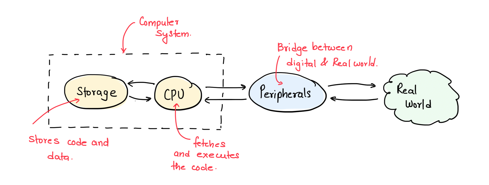

+++
date = '2026-07-10T10:00:00+05:30'
draft = false
title = 'History of Computing'
description = 'One cannot reason about the workings of the computer without knowing how they came to be. The modern computer systems are based on this fundamental design from the 1900s...'
og_image = '1970s-world-view.jpeg'
difficulty = 'easy'
language = 'c'
topic_weight = -20
subtopic_weight = 1
weight = 1
initial_code = '''/*
 * Copyright © 2026 Typobrahe Education LLP (pyjamacafe.com)
 * All Rights Reserved.
 *
 * Description: Simple Hello World program demonstrating C basics.
 */
#include <stdio.h>

int main(void) {
    printf("Welcome to PyjamaCafe!\n");
    return 0;
}
'''
+++

## Warm up!!

Let's make you familiar with running code on this platform.

---

# Basics
- On the right, is the code editor. We will use this to write code.
- Right bottom is the Terminal. The output from code execution will be seen here.
- You can type basic linux commands at the `$` prompt in the terminal.
- The code editor has files with the names tab on the top. `main.c` in this case.
- Clicking the `Check` button will compile and run the code in the code editor. The `Reset` button restores the code.

# You Try:
1. Hit the `Check` button. You should see the output in the terminal like:
    ```shell
    All test cases passed.
    Welcome to PyjamaCafe!

    Exit code: 0
    ```
    - Line #2 from above is the output as a result of #10 in `main.c`
    - Line #1 and #4 are outputs appended by us to convey the state of the tests and the exit code of the program.
1. Modify the `Welcome to PyjamaCafe!` line to something else and execute the code again. Check the output.
1. Type `uname` at the `$` in the terminal and hit the Return/Enter key. You should see an output like so
    ```shell
    $ uname
    Linux
    ```

# For later

You are not expected to understand the code in the Code editor. This is something we will discover and learn in the chapters to come.

===EXPLANATION===

The history of computing is not a smooth linear progression — it is a series of discontinuous leaps driven by physics, war, and business. The mechanical era ended not because Babbage's designs were wrong (they were brilliant) but because machining couldn't reliably produce gears to the required tolerance. The electromechanical era died when it became clear that relays would never be fast enough for complex calculations.

Each era created a bottleneck that the next era's invention shattered. The transistor didn't just make computers smaller — it made them cheaper by a factor of millions, which is what made embedded systems economically viable. A vacuum-tube computer controlling a toaster would cost $200,000; a microcontroller costs $0.50.

# Timeline



- **Mechanical era (1600s–1930s)**: Pascal's Pascaline (1642), Leibniz's Step Reckoner, and Babbage's Difference Engine (1822) and Analytical Engine (1837) — the first general-purpose computer design with separate "mill" (CPU) and "store" (memory), programmed via punched cards inspired by Jacquard looms.
- **Electromechanical era (1930s–1940s)**: Zuse's Z3 (1941, Germany) — first working programmable electromechanical computer. Howard Aiken's Harvard Mark I (1944) — 51 feet long, 5 tons, 765,000 components.
- **Electronic era — vacuum tubes (1940s–1950s)**: ENIAC (1945) — 17,468 vacuum tubes, 30 tons, could perform 5,000 additions per second. John von Neumann's architecture (stored-program concept) became the universal template. UNIVAC I (1951) — first commercial computer.
- **Transistor revolution (1947–1960s)**: Shockley, Bardeen, and Brattain invented the transistor at Bell Labs (1947). Transistors replaced vacuum tubes: smaller, faster, cooler, more reliable. IBM 1401 (1959) — first mass-produced all-transistor computer.
- **Integrated Circuit (1958–1970s)**: Jack Kilby (TI) and Robert Noyce (Fairchild) independently invented the IC. The first microprocessor — Intel 4004 (1971) — had 2,300 transistors at 740 kHz. Intel 8080 (1974) powered the Altair 8800. The 8051 microcontroller (1980) integrated CPU, RAM, ROM, and I/O on one chip — the birth of the embedded system.
- **Modern era (1990s–present)**: ARM architecture (1985, Acorn), RISC-V (2010, UC Berkeley). Today's microcontrollers pack millions of transistors, multiple cores, and wireless radios on a single chip costing pennies. The Raspberry Pi Pico RP2040 (2021) — dual-core Cortex-M0+, 264 KB SRAM, for $1.



# Embedded Computer?

The key insight is that embedded systems are not simplifications of desktop computers — they are a return to the original computing model. The Analytical Engine was a dedicated machine designed to solve specific mathematical problems. The ENIAC was built to calculate artillery tables. The earliest computers were all "embedded" in the sense that they were built for a single purpose, housed in a single room. The general-purpose, stored-program computer (the von Neumann architecture) was the detour — it allowed one machine to do anything, but at the cost of efficiency.

Embedded systems reverse this: they optimize for a single task (control a motor, read a sensor, send a packet) and strip away everything unnecessary. A modern microcontroller is closer in spirit to Babbage's mill than to a desktop CPU.

# The C Language

The C programming language itself has a rich history tied to this computing evolution. Developed by Dennis Ritchie at Bell Labs in the early 1970s, C originated as a successor to the B programming language (which itself descended from BCPL). C was designed with simplicity and portability in mind — providing a concise set of features and a small standard library that allowed programs to be easily transferred between different hardware platforms. Its significance cannot be overstated: the UNIX operating system was rewritten in C, and UNIX's adoption by academia and industry catapulted C to worldwide prominence.

C introduced structured programming constructs — functions, loops, and conditional statements — that promoted code organization and modularity. At the same time, it provided direct memory access and manual control over hardware resources, making it uniquely suited for system-level programming, embedded systems, and operating system development. For a deeper dive, Brian Kernighan (one of Unix's inventors) discusses the history of C in the Computerphile video below.



# Computers in 1970s
<!--auth-->
The key to understanding C is learning to think like an engineer from the 1970s — someone who understood the hardware at a deep level and could look at code and infer what the CPU would do at each step. Figure 1 shows this worldview: storage has code and data that the CPU can access via address and data buses. Following instructions and manipulating stored data, the CPU performs calculations and influences the external world. This mental model is the foundation for everything that follows in embedded systems programming.

<figure id="fig-1" class="fig-center">
  
  <figcaption><a href="#fig-1" class="fig-link">Figure 1:</a> How engineers in the 1970s thought about computer systems — storage containing code and data that the CPU can access</figcaption>
</figure>

# Influence

C's influence extends far beyond its own ecosystem. Modern programming languages including C++, Java, and Python have borrowed syntax and concepts from C, making it a foundational language in computer science education. C continues to be the backbone of operating systems (Windows, macOS, Linux are largely written in C), firmware for smartphones and routers, embedded systems in automotive and medical devices, telecommunications protocols (Ethernet, TCP/IP), and game engines (Unity, Unreal Engine).

# Relevance in today's World

Every modern embedded device is a direct descendant of these inventions. Your car contains 50–100 microcontrollers (ECUs) managing everything from engine timing to window motors. The Fitbit on your wrist runs an ARM Cortex-M processor — descendents of the 1985 Acorn RISC Machine. The Intel 4004's 2,300 transistors have become the 16 billion transistors in an Apple M3 Ultra — a ratio of nearly 7 million to one. The critical path: transistors → ICs → microprocessors → microcontrollers → systems-on-chip (SoCs).

C remains an integral part of our technological landscape. Its versatility, performance, and widespread usage across various industries continue to make it a foundational language for software development, powering the technology that shapes our everyday experiences.
<!--/auth-->

===QUIZ===

## Who is credited with designing the first general-purpose mechanical computer — the Analytical Engine — which included a separate processing unit (the "mill") and memory (the "store")?
- [ ] Alan Turing
- [x] Charles Babbage
- [ ] John von Neumann
- [ ] Konrad Zuse
Correct: B
Explanation: Charles Babbage designed the Analytical Engine in 1837. It was never built in his lifetime, but its architecture — with separate mill (CPU) and store (memory), punched-card programming, and conditional branching — anticipated the modern computer by over a century. Ada Lovelace wrote programs for it, making her the first programmer.

## What invention is widely considered the single most critical enabler of modern embedded systems?
- [ ] The vacuum tube
- [x] The integrated circuit
- [ ] The hard disk drive
- [ ] The graphical user interface
Correct: B
Explanation: The integrated circuit (invented 1958 by Jack Kilby and Robert Noyce) allowed all components of a computer — CPU, memory, I/O — to be fabricated on a single silicon die. This made it possible to manufacture complete computing systems for pennies, leading directly to the microcontroller (CPU + RAM + ROM + peripherals on one chip) and the explosion of embedded devices.

## Who developed the C programming language and at which organization?
- [ ] Brian Kernighan at MIT
- [x] Dennis Ritchie at Bell Labs
- [ ] Ken Thompson at Xerox PARC
- [ ] Linus Torvalds at University of Helsinki
Correct: B
Explanation: Dennis Ritchie developed C at Bell Labs in the early 1970s as a successor to the B programming language. It was designed for simplicity and portability, and its development was closely tied to the UNIX operating system.

## What was the significance of the Intel 4004 microprocessor released in 1971?
- [ ] It was the first computer to use vacuum tubes
- [ ] It was the first integrated circuit
- [x] It was the first microprocessor — packing 2,300 transistors on a single chip at 740 kHz
- [ ] It introduced the Harvard architecture
Correct: C
Explanation: The Intel 4004 was the world's first commercially available microprocessor, integrating the entire CPU onto a single chip with 2,300 transistors. This milestone paved the way for affordable computing and eventually embedded systems.

## C remains relevant today because it is used in which of the following areas?
- [ ] Only in web development
- [x] Operating systems, firmware, embedded systems, and game engines
- [ ] Only in academic research
- [ ] Only in mobile app development
Correct: B
Explanation: C remains foundational across many industries — operating systems (Windows, macOS, Linux), firmware for smartphones and routers, embedded systems in automotive and medical devices, and game engines like Unity and Unreal Engine are all built largely in C.

## What key insight about embedded systems does the chapter emphasize regarding the evolution of computing?
- [ ] Embedded systems are simplified versions of desktop computers
- [x] Embedded systems return to the original computing model — dedicated machines for specific tasks
- [ ] Embedded systems were invented after desktop computers
- [ ] Embedded systems require an operating system to function
Correct: B
Explanation: The chapter argues that early computers (Analytical Engine, ENIAC) were dedicated single-purpose machines — essentially "embedded" in their design. The general-purpose stored-program computer was the historical detour, and modern embedded systems reverse this by optimizing for a single task, making them closer in spirit to Babbage's mill than to a desktop CPU.

