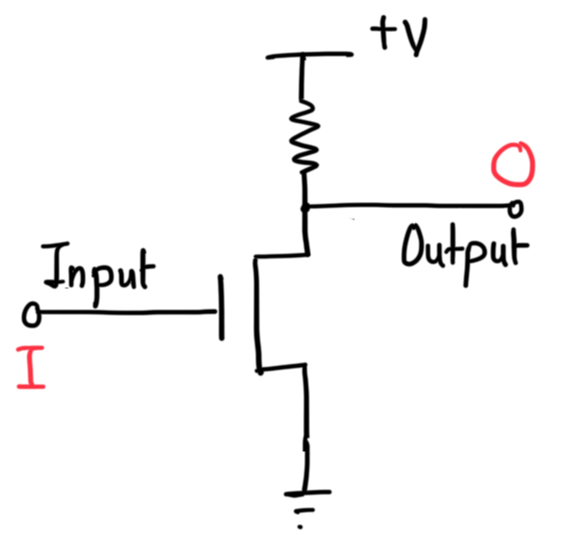
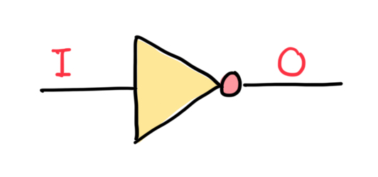
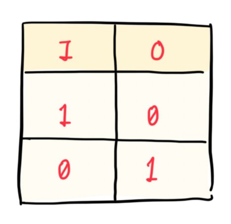
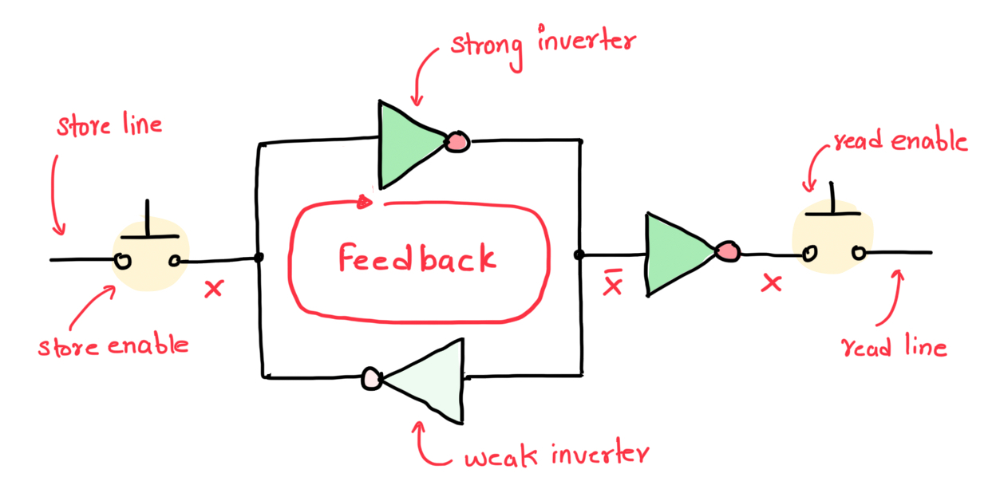
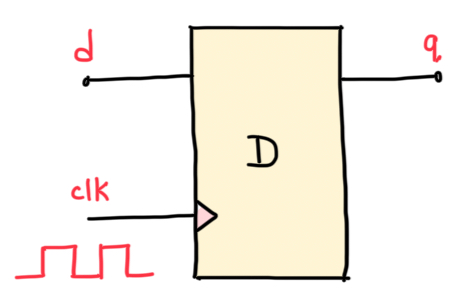
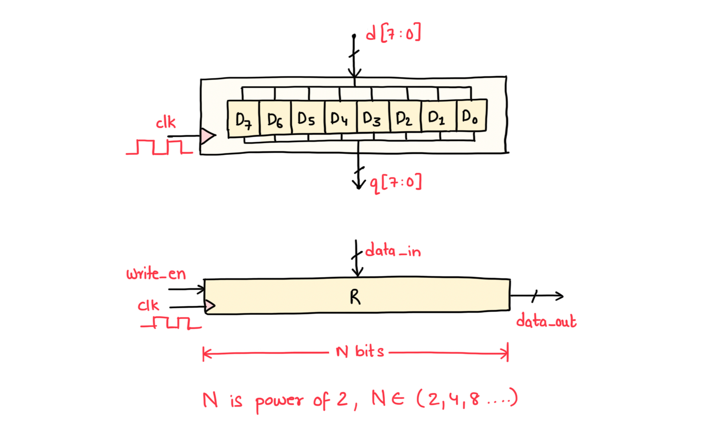
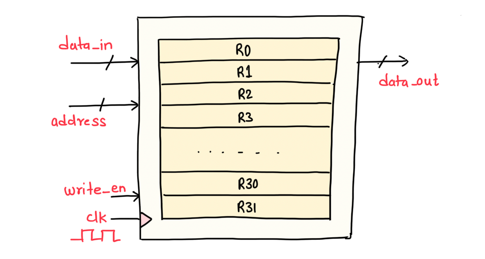
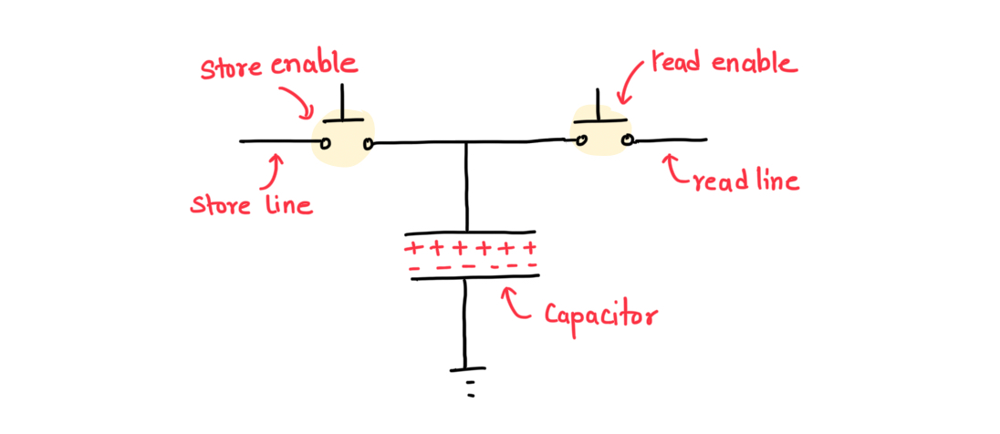
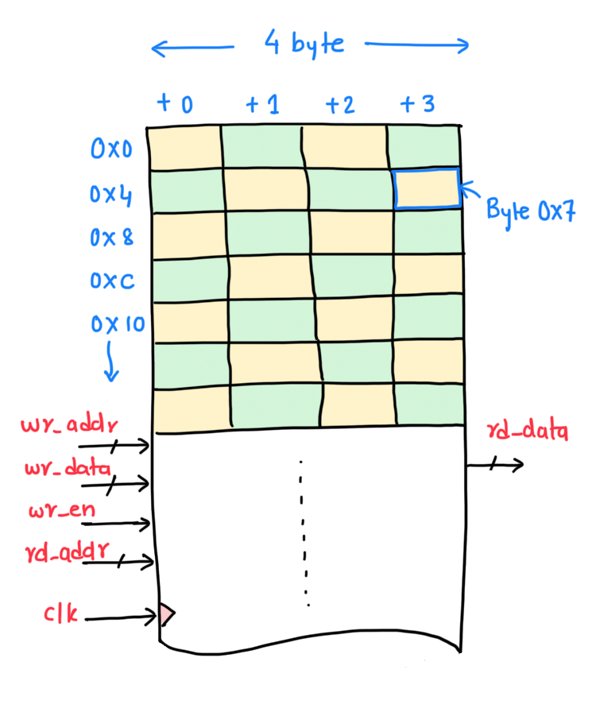

+++
date = '2026-07-10T10:00:00+05:30'
draft = true
title = 'Storage Models and Memory Technologies'
difficulty = 'easy'
language = 'c'
topic_weight = -20
subtopic_weight = 1
weight = 6
initial_code = '''/*
 * Copyright © 2026 Typobrahe Education LLP (pyjamacafe.com)
 * All Rights Reserved.
 *
 * Description: Demonstrates memory sections — .data, .bss, stack, and static variables.
 */
#include <stdio.h>

int global_init = 42;      // .data (Flash/RAM)
int global_uninit;         // .bss (RAM, zero-initialized)

int main(void) {
    int local = 10;        // stack (RAM)
    static int count = 0;  // .bss (RAM)
    count++;
    printf("global=%d, local=%d, count=%d\n",
           global_init, local, count);
    return 0;
}
'''
+++

## Problem Statement

How do different memory technologies (SRAM, DRAM, Flash, EEPROM) work at the physical level? Where is each type used in embedded systems, and why? Explain the memory hierarchy model and the concept of memory-mapped I/O.

## Theory and Concepts

- **Memory hierarchy (from fastest/smallest to slowest/largest)**:
  1. **CPU registers** (SRAM flip-flops, ~1 cycle, ~1 KB total)
  2. **L1 Cache** (SRAM, ~2–4 cycles, 16–64 KB)
  3. **L2/L3 Cache** (SRAM, ~10–40 cycles, 256 KB–32 MB)
  4. **Main memory (RAM)** (DRAM, ~50–100 ns, MB–GB)
  5. **Non-volatile storage** (Flash/SSD, ~10–100 μs, GB–TB)
  6. **Mass storage** (HDD, ~5–10 ms, TB)
  Each level is larger, slower, and cheaper per bit than the level above. The hierarchy exploits **locality of reference**: programs tend to access the same memory locations repeatedly (temporal locality) and nearby locations (spatial locality).

- **SRAM (Static RAM)**:
  - Uses 6 transistors per bit (two cross-coupled inverters forming a flip-flop).
  - **Static**: retains data as long as power is supplied — no refresh needed.
  - Fast (~1–10 ns access time), low density, high power per bit.
  - Used for: CPU caches (L1, L2, L3), microcontroller on-chip RAM (e.g., 256 KB in RP2040), register files.

- **DRAM (Dynamic RAM)**:
  - Uses 1 transistor + 1 capacitor per bit. The capacitor holds a charge (1) or no charge (0).
  - **Dynamic**: charge leaks away in milliseconds — must be **refreshed** thousands of times per second.
  - Dense (cheap per bit), moderate speed (~50–100 ns), requires refresh controller.
  - Used for: main memory (PCs, servers), large RAM buffers in SoCs.
  - Types: SDRAM, DDR4, DDR5, LPDDR5 (low-power for mobile/embedded).

- **Flash Memory**:
  - Uses floating-gate MOSFETs. Electrons are trapped on a floating gate between the control gate and the channel.
  - **Non-volatile**: retains data for 10–20 years without power.
  - **NAND Flash**: dense, block-oriented (read/write in pages of 4–16 KB, erase in blocks of 128–512 KB). Used for SSDs, SD cards, eMMC.
  - **NOR Flash**: byte-addressable, faster reads, slower writes. Used for code storage in microcontrollers (execute-in-place, XIP).
  - Erase cycles are limited (~10,000–100,000 for NAND, ~100,000 for NOR). Wear-leveling algorithms distribute writes.

- **EEPROM (Electrically Erasable Programmable ROM)**:
  - Similar to Flash but byte-erasable (no block erase needed).
  - Slower and lower density than Flash.
  - Used for: configuration storage (calibration data, device ID, MAC address), typically just a few KB.

- **Memory-Mapped I/O (MMIO)**:
  - Peripheral registers (GPIO, UART, SPI, timers) are assigned fixed addresses in the memory map. Reading or writing those addresses reads or writes the peripheral's hardware registers.
  - On an ARM Cortex-M4, `*(volatile uint32_t*)0x40020014 = 0x01;` sets GPIO output high. The bus hardware decodes the address and routes the write to the GPIO peripheral, not to RAM.

## Real World Application

A modern smartphone uses every memory technology simultaneously: registers and L1 cache (SRAM in the Cortex-A CPU core), L2/L3 cache (larger SRAM arrays), main RAM (LPDDR5 DRAM — 8–16 GB), firmware storage (UFS NAND Flash — 128–512 GB), and configuration EEPROM (for camera calibration, touchscreen tuning — just a few KB on the I2C bus). In an STM32 microcontroller: 2 MB of NOR Flash for code, 512 KB of SRAM for stack and heap, and 4 KB of EEPROM emulated in Flash for persistent configuration. The ESP32 uses embedded SRAM (520 KB) plus optional external PSRAM (up to 8 MB, DRAM-like) and external Flash (up to 16 MB, NOR) via SPI.

===EXPLANATION===

Memory technology is governed by a fundamental engineering tradeoff: speed, density, and volatility are linked through physics. SRAM is fast because a flip-flop is an active circuit — it constantly drives its own state. But that takes 6 transistors per bit — a 32 KB L1 cache uses ~1.5 million transistors just for the storage cells, plus peripheral logic. DRAM is denser (1 transistor per bit) because it stores charge passively in a capacitor, but the charge leaks — every row must be read and rewritten (refreshed) every 64 ms. This refresh consumes power and makes DRAM slower (you may have to wait for a refresh cycle to complete). Flash stores charge on an isolated floating gate — no power needed, but writing requires a high voltage (10–20 V) generated by an on-chip charge pump, which takes microseconds and wears out the oxide layer. These physical constraints are not going away — they are fundamental limits of silicon physics. Emerging technologies (MRAM, RRAM, PCM) try to combine the speed of SRAM, the density of DRAM, and the non-volatility of Flash, but none has achieved all three at competitive cost.

The intuition: think of storage technologies as different types of containers. SRAM is a glass of water — you can see the water level instantly (fast read), you can pour more water instantly (fast write), but if the tray (power) is tilted, the water spills (volatile). DRAM is a bucket with a tiny hole in the bottom — you have to keep refilling it (refresh) or it empties. Flash is a sealed jar — it holds its contents for years, but opening the jar takes effort (slow write, high voltage), and the lid wears out after repeated openings (limited erase cycles). EEPROM is a jar with a small spoon — you can take out one grain of rice at a time (byte-erasable). The memory hierarchy is your kitchen: the spices you use every second (registers) are on the counter right in front of you; the ones you use every minute (L1 cache) are in the rack above the stove; the ones you use every hour (DRAM) are in the pantry; the ones you use once a year (Flash/SSD) are in the basement.

Memory-mapped I/O is the bridge between programming and hardware. When you write `*((volatile uint32_t *)0x40020014) = 0x01;` on an STM32, you are not storing a value in RAM — you are writing to a hardware register called the `ODR` (Output Data Register) of GPIO Port A. The address decoder in the system bus recognizes the address range 0x40020000–0x400203FF as belonging to GPIOA and routes the write transaction to the GPIO peripheral's bus interface, which in turn asserts or de-asserts the voltage on pin PA0. This is the fundamental mechanism by which software controls hardware in embedded systems. Every embedded C programmer must understand that a pointer in embedded code is not always pointing to memory — it may be talking to a timer, a UART, an ADC, or a hardware PWM generator.

## Ways to Store a Bit

At the lowest level, storage comes down to how a single **bit** is physically implemented. There are two fundamental approaches: **feedback-based** and **charge trapping**. These two techniques underlie virtually all modern solid-state memory.

### Feedback-Based Storage (SRAM, Registers, Flip-Flops)

Feedback-based storage uses a loop of logic gates to trap a signal value. Consider a NOT gate (inverter), whose symbol and truth table are shown in Figures 5 and 6. A transistor-level implementation using MOSFETs is shown in Figure 7. If two NOT gates are connected in series and the output of the second is fed back to the input of the first (Figure 8), the circuit traps its own state. The process uses two types of inverters: a **strong inverter** and a **weak inverter**. When a bit is to be stored, the strong inverter overpowers the weak one: the bit value is placed on the "Store line", the strong inverter absorbs the logical value and outputs its inverse, and the weak inverter inverts that output and feeds it back. Once the feedback loop stabilizes, the Store line can be disconnected, and the value remains trapped as long as power is supplied.

<figure id="fig-7" class="fig-right">
  
  <figcaption><a href="#fig-7" class="fig-link">Figure 7:</a> Transistor circuit implementation of the NOT logic gate using MOSFETs</figcaption>
</figure>

<figure id="fig-5" class="fig-right">
  
  <figcaption><a href="#fig-5" class="fig-link">Figure 5:</a> Symbolic representation of the NOT gate (inverter) used in feedback-based storage</figcaption>
</figure>

<figure id="fig-6" class="fig-right">
  
  <figcaption><a href="#fig-6" class="fig-link">Figure 6:</a> Truth table for the NOT gate — input 1 produces output 0 and vice versa</figcaption>
</figure>

<figure id="fig-8" class="fig-center">
  
  <figcaption><a href="#fig-8" class="fig-link">Figure 8:</a> Feedback-based memory bit using two inverters in a loop to trap a logical value</figcaption>
</figure>

## Bit, Register and Register File

A clocked version of this feedback circuit is called a **D flip-flop** (Figure 1). On each rising edge of the clock (transition from 0 to 1), the value at the **d** input is captured and held at the **q** output until the next clock edge. D flip-flops are the basic building blocks of all sequential logic in digital systems.

<figure id="fig-1" class="fig-right">
  
  <figcaption><a href="#fig-1" class="fig-link">Figure 1:</a> D flip-flop circuit diagram used in SRAM storage</figcaption>
</figure>

**Registers** are formed by grouping multiple D flip-flops side by side (Figure 2). A group of 8 flip-flops creates an 8-bit register; 32 flip-flops create a 32-bit register — the standard width for RISC-V and ARM CPUs. **Register files** combine multiple registers with addressing logic (Figure 3). Given an address (register number) and data_in, the value is loaded into the selected register if write_en is 1 and the clock transitions from 0 to 1. The register file has multiple ports for simultaneous reads and writes.

<figure id="fig-2" class="fig-center">
  
  <figcaption><a href="#fig-2" class="fig-link">Figure 2:</a> Register implementation in SRAM technology</figcaption>
</figure>

<figure id="fig-3" class="fig-center">
  
  <figcaption><a href="#fig-3" class="fig-link">Figure 3:</a> Register file abstraction layer</figcaption>
</figure>

### Charge Trapping (Flash, EEPROM, DRAM)

Charge trapping stores a bit by depositing or withdrawing electrical charge on a capacitor (Figure 9). The presence or absence of charge conveys the logical state (0 or 1). When the **store enable** signal is active, charge flows onto or off the capacitor depending on the **store line** logic level. The **read enable** and **read line** probe the capacitor's charge state to determine the stored value. This technique is used in EEPROM (Electrically Erasable Programmable Read-Only Memory) and Flash memory, where charge is trapped on the floating gate of a MOSFET. Unlike feedback-based circuits, charge trapping is **non-volatile** — it retains data even when power is removed. However, charge-trapping cells are more complex to design, slower to write, and have limited erase cycles compared to feedback-based circuits.

<figure id="fig-9" class="fig-center">
  
  <figcaption><a href="#fig-9" class="fig-link">Figure 9:</a> Charge storage-based memory bit — a capacitor stores charge to represent logical 0 or 1</figcaption>
</figure>

### From Bits to Memory

## Memory

To organize storage into a usable model: a **Byte** is 8 Bits, a **Half-Word** is 2 Bytes (16 bits), a **Word** is 4 Bytes (32 bits), and a **Double Word** is 8 Bytes (64 bits). For practical purposes, you can assume memory is a long register file as shown in Figure 4 — an array of 8-bit wide registers with byte-level addressability. Memory is addressable at the byte level, meaning each byte has a unique address. The CPU reads or writes 1, 2, or 4 bytes at a time by placing the address on the bus and either reading the data (load) or writing the data (store). Processors cannot directly access individual bits in memory — they always work in byte-sized or word-sized chunks.

<figure id="fig-4" class="fig-right">
  
  <figcaption><a href="#fig-4" class="fig-link">Figure 4:</a> Memory array organization and structure</figcaption>
</figure>

References: Hennessy & Patterson, "Computer Architecture: A Quantitative Approach" §2.1–2.3 (memory hierarchy); Micron DDR5 datasheet (for DRAM timing parameters); STM32F4 Reference Manual §2.3 (memory map and MMIO). For Flash physics: "Nonvolatile Memory Technologies with Emphasis on Flash" by Brewer & Gill (Wiley, 2008). For the classic paper on SRAM vs DRAM: "A 1-Mbit CMOS SRAM" by Suzuki et al. (IEEE JSSC, 1990).

===QUIZ===

## Why does DRAM require periodic refresh while SRAM does not?
- [ ] DRAM uses magnetic storage which decays; SRAM uses optical storage
- [x] DRAM stores each bit as charge on a capacitor that leaks over milliseconds; SRAM uses a flip-flop (cross-coupled inverters) that actively holds its state as long as power is supplied
- [ ] DRAM must be refreshed because the CPU reads it destructively
- [ ] DRAM does not actually require refresh — it is a common misconception
Correct: B
Explanation: DRAM stores a bit as charge on a tiny capacitor (1T1C cell). Due to leakage currents (primarily from the access transistor), this charge dissipates in about 64 ms. The memory controller must read (sense) and rewrite each row periodically to restore the charge. SRAM uses a 6-transistor flip-flop (two inverters in positive feedback) — the circuit actively drives the stored value, maintaining it indefinitely as long as power is applied. No refresh needed.

## In embedded systems, what does "memory-mapped I/O" mean?
- [ ] I/O devices are connected via a separate I/O bus with special I/O instructions
- [x] Peripheral control registers are assigned addresses in the CPU's regular memory address space — reading/writing those addresses controls the peripheral
- [ ] The CPU has a separate address space for I/O with dedicated assembly instructions
- [ ] All peripherals share the same memory address as the main RAM
Correct: B
Explanation: Memory-mapped I/O (MMIO) assigns peripheral registers (GPIO, UART, SPI, timers) to specific addresses in the CPU's memory map. The CPU uses the same load/store instructions to access peripherals as it does for RAM. The bus address decoder routes the transaction to the appropriate peripheral based on the address. This is the dominant model in ARM Cortex-M, RISC-V, and most microcontroller architectures. The alternative (port-mapped I/O, as in x86) uses separate IN/OUT instructions.

## What is feedback-based storage and how does it work?
- [ ] It stores charge on a capacitor like DRAM
- [x] It uses a loop of logic gates (two inverters in a feedback loop) to trap a signal value, retaining data as long as power is supplied
- [ ] It uses magnetic domains on a spinning disk
- [ ] It relies on quantum tunneling effects
Correct: B
Explanation: Feedback-based storage uses a pair of inverters (NOT gates) connected in a loop. A strong inverter overpowers a weak inverter to set the bit, and the feedback loop maintains the value indefinitely as long as power is supplied. This is the basis for SRAM cells, registers, and flip-flops.

## What is a D flip-flop and how is it used in building registers?
- [x] A D flip-flop stores a single bit, capturing the value at its d input on each rising clock edge
- [ ] A D flip-flop stores 32 bits
- [ ] A D flip-flop is used for analog-to-digital conversion
- [ ] A D flip-flop generates clock signals
Correct: A
Explanation: A D flip-flop is a clocked feedback circuit that captures the value at its data (d) input on each rising edge of the clock and holds it at the output (q) until the next clock edge. Grouping multiple D flip-flops (e.g., 32) side by side creates a register.

## How does NOR Flash differ from NAND Flash?
- [x] NOR Flash is byte-addressable with faster reads, used for execute-in-place code storage; NAND Flash is denser but block-oriented
- [ ] NOR Flash is slower than NAND Flash for all operations
- [ ] NAND Flash is byte-addressable
- [ ] NOR Flash requires a battery to retain data
Correct: A
Explanation: NOR Flash is byte-addressable with fast read access, making it suitable for execute-in-place (XIP) code storage in microcontrollers. NAND Flash is denser but requires page-level reads and block-level erases, making it better for mass storage like SSDs and SD cards.

## What are the standard memory size units used in computer organization?
- [x] Bit, Byte (8 bits), Half-Word (2 bytes), Word (4 bytes), Double Word (8 bytes)
- [ ] Bit, Byte (16 bits), Word (2 bytes)
- [ ] Bit, Nibble (2 bits), Byte (6 bits)
- [ ] Byte (4 bits), Word (2 bytes), Long Word (12 bytes)
Correct: A
Explanation: The standard memory units are: Bit (1 binary digit), Byte (8 bits), Half-Word (2 bytes/16 bits), Word (4 bytes/32 bits), and Double Word (8 bytes/64 bits). Memory is addressable at the byte level.
