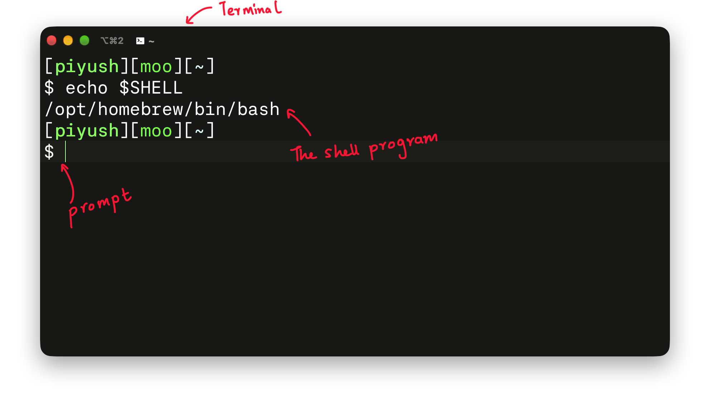

+++
title = 'Linux Commandline/Tools'
og_image = 'es001.png'
description = 'An introductory course on Linux command-line and shell scripting. This is intended for total beginners and intended to make them comfortable working with the shell/terminal.'
date = '2026-07-10T10:00:00+05:30'
draft = false
layout = "reading"
+++



An introductory course on Linux command-line and shell scripting. This is intended for total beginners and aimed at making you comfortable working with the shell/terminal.

# Why this course?

Like it or not, Linux is the dominant development environment for Embedded Systems. One has to be very comfortable using the terminal/shell to be able to work effectively.

This course is intended to be an introduction and focused on enabling anyone to becoming comfortable working with the Terminal.

# Who this is for?

The course assumes no background and is intended for absolute beginners.

# What to expect?

By the end of the course, you will be comfortable using the shell and self discover/navigate new ways of using the commandline.

===READING===

# Shell and the Kernel

The Linux Kernel is the core of the operating system and abstracts the hardware from the user. The question to ask is -- how does the user interact with the hardware?

The answer is -- shell!

The `shell` is a user level program that can help us talk to the kernel and get it do various things, like talking to the hardware. Shell is the bridge between the user and the kernel. We can start new processes, run programs etc.

# What is a terminal?

Terminal is an interface to the shell. You can imagine that it exposes the shell program in a graphical interface on modern systems. As in the image below anything that we type of the `prompt` is fed to `bash` which is one of the shells.

We will explore the history of terminal and shell as the course progresses. Just some good to know stuff :)
