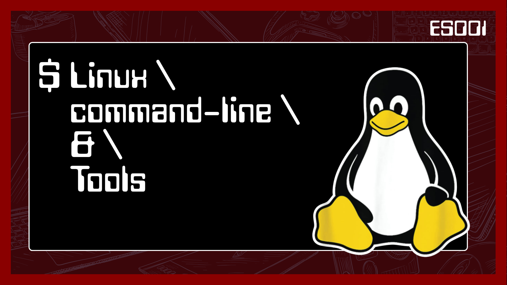

+++
title = 'Linux Commandline/Tools'
og_image = 'es001.png'
description = 'An introductory course on Linux command-line and shell scripting. This is intended for total beginners and intended to make them comfortable working with the shell/terminal.'
date = '2026-07-10T10:00:00+05:30'
draft = false
layout = "reading"
+++

<!--explanation-->
# Linux Commandline/tools

An introductory course on Linux command-line and shell scripting. This is intended for total beginners and is meant to make you comfortable working with the shell/terminal.

# Includes
- 3 hr 47 mins of recorded lectures.
- 14 Lessons.
- Shell essentials for total beginners
- Practical shell scripting examples

# What you will learn?
- Get comfortable working with the Linux/Unix shell and terminal.
- Essential commands: navigation, files, searching, editors and compression.
- Use the VI editor for basic editing.
- Write shell scripts with variables, conditionals, loops and functions.
- Use regular expressions and get an LLM to write scripts for you.
<!--/explanation-->

<!--reading-->
# Instructor


# What sets this apart?
- Built for total beginners.
- Covers the command line end to end.
- Practical, example-driven shell scripting.

# Audience
- Total beginners to the Linux command line.
- Students and freshers getting into embedded and systems work.

# Requirements
- A computer to follow along.
- No prior command-line experience needed.
<!--/reading-->
